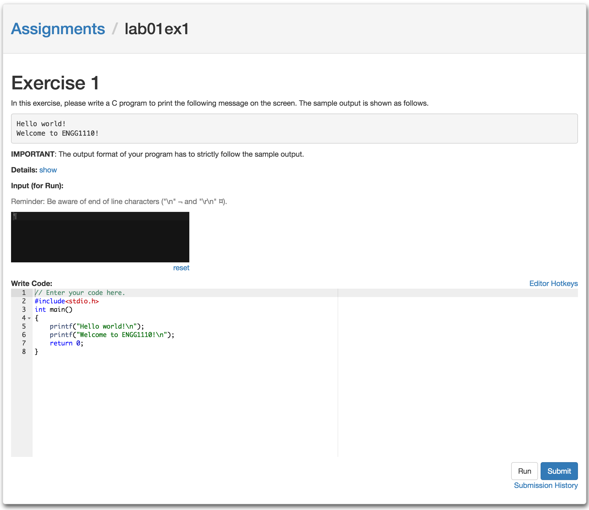

# codeSubmit
> write __Code__ then __Submit__

*codeSubmit* is an online judge for programming assignments. It is initially developed for supporting the online course taught by [Dr. Wong Tsz Yeung](http://www.cse.cuhk.edu.hk/~tywong/html/index.html) at [CUHK](http://www.cuhk.edu.hk), see [here](http://tywong.github.io/gitbook-engg1110/).

Besides this online judge, we also built a platform for students to program game playing AI and compete with each other. See our [aimole](https://github.com/leoyuholo/aimole) project.

## Screenshot

## Deployment
To deploy codeSubmit, you need to have a running MongoDB, a running RabbitMQ first. To spin them up, you can run `shellscripts/docker/mongodb/mongodb_up.sh` and `shellscripts/docker/rabbitmq/rabbitmq.sh`.

And then, configure codeSubmit by modifying `configs/*Config.coffee`.

To spin up codeSubmit admin for production use, run `shellscripts/docker/production/admin_up.sh`.

To spin up codeSubmit student for production use, run `shellscripts/docker/production/student_up.sh`.

To spin up codeSubmit worker for production use, run `shellscripts/docker/production/worker_up.sh`.

For deploying more instances on multiple machines, run the corresponding [admin, student, worker] script with an extra argument of master ip. E.g. `shellscripts/docker/production/worker_up.sh 192.168.0.101` to spin up a worker with databases connecting to `192.168.0.101`. Same for codeSubmit admin and codeSubmit student.

## Development
To spin up all the stuffs for development, run `shellscripts/docker/codesubmit/codesubmit_up.sh`. This will spin up a MongoDB, RabbitMQ, codeSubmit admin, codeSubmit student and codeSubmit worker. And watch for file changes to restart all three codeSubmit instances (admin, student and worker).

To spin up things individually:

Run `shellscripts/docker/mongodb/mongodb_up.sh` for MongoDB.
Run `shellscripts/docker/rabbitmq/rabbitmq.sh` for RabbitMQ. And you can monitor RabbitMQ via visiting http://localhost:15672.

To watch changes and livereload for admin, run `grunt` and visit `http://localhost:8000`
To watch changes and livereload for student, run `grunt student` and visit `http://localhost:8001`
To watch changes and livereload for worker, run `grunt worker`

# LICENSE
This program is free software: you can redistribute it and/or modify
it under the terms of the GNU General Public License as published by
the Free Software Foundation, either version 3 of the License, or
(at your option) any later version.

This program is distributed in the hope that it will be useful,
but WITHOUT ANY WARRANTY; without even the implied warranty of
MERCHANTABILITY or FITNESS FOR A PARTICULAR PURPOSE.  See the
GNU General Public License for more details.

You should have received a copy of the GNU General Public License
along with this program.  If not, see <http://www.gnu.org/licenses/>.
